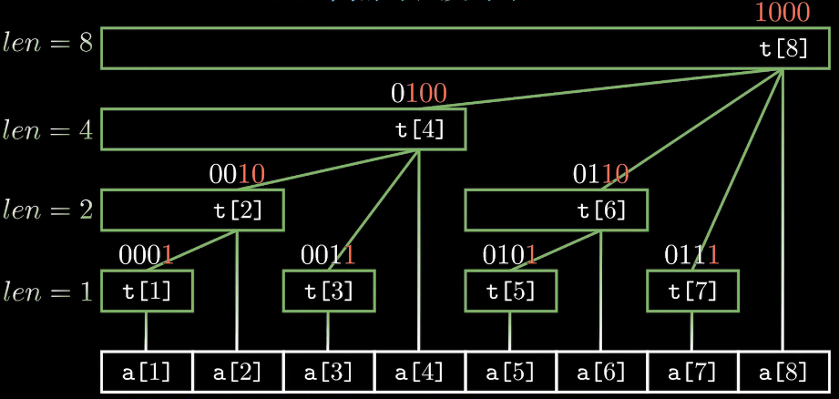

```txt
前置：lowbit操作（返回二进制表示的最后一个1及其后面的0）
例如：
    tr[i] 的区间含义 (i - lowbit(i), i] 准确
    tr[i] 存的是 (i - lowbit(i), i] 这段的和 长度为lowbit(i)
    7的二进制表示是：0111
    查询：ask(7) = tr[7] + tr[7 - lowbit(7) = 6] 
                    + tr[6 - lowbit(6) = 4]
    修改：add(1,x)
        add(1,x)
        add(1 + lowbit(1) = 2,x)
        add(2 + lowbit(2) = 4,x)
        add(4 + lowbit(4) = 8,x)
单点更新：
    void add(int x,LL y){
        for(int i = x;i <= n;i += lowbit(i)){
            tr[i] += y;   
        }
    }
前缀查询：
    LL sum(int u){
        LL res = 0;
        for(int i = u;i;i -= lowbit(i)){
            res += tr[i];
        }
        return res;
    }
经典类型：
    单点加，区间查
    区间修改 + 单点查询（配合差分）
    二维偏序 / 数点问题
    值域树状数组(求第k小，第k大，逆序对等等)
```


